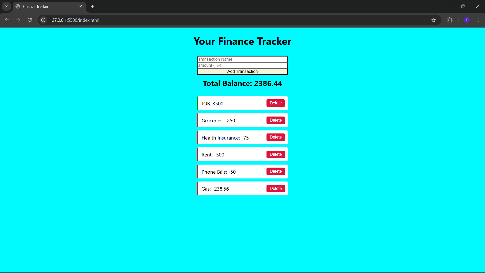

# 💰 Finance Tracker

A simple, responsive web app to track income and expenses. Users can add transactions, see a running balance, and delete entries — all in real-time using JavaScript.

---

## 🚀 Features

- ✅ Add income and expense transactions
- ✅ Auto-calculated total balance
- ✅ Color-coded list (green = income, red = expense)
- ✅ Delete transactions with a click
- ✅ Persistent data using `localStorage`
- ✅ Clean, responsive layout

---

## 🛠️ Tech Stack

- **HTML**
- **CSS**
- **JavaScript**

---
